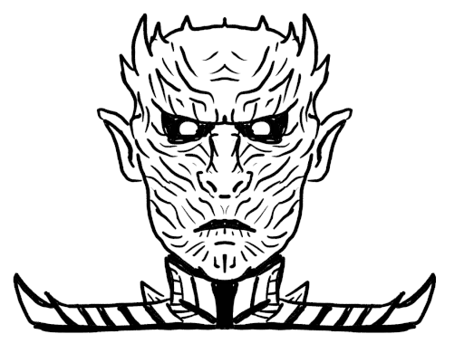

<br><br><br>

# SketchPatch: Sketch Stylization via Seamless Patch-level Synthesis

This is a PyTorch implementation of our paper "SketchPatch: Sketch Stylization via Seamless Patch-level Synthesis", SIGGRAPH Asia 2020.


### Abstract

The paradigm of image-to-image translation is leveraged for the benefit of sketch stylization via transfer of geometric textural details. Lacking the necessary volumes of data for standard training of translation systems, we advocate for operation at the patch level, where a handful of stylized sketches provide ample mining potential for patches featuring basic geometric primitives. Operating at the patch level necessitates special consideration of full sketch translation, as individual translation of patches with no regard to neighbors is likely to produce visible seams and artifacts at patch borders. Aligned pairs of styled and plain primitives are combined to form input hybrids containing styled elements around the border and plain elements within, and given as input to a seamless translation (ST) generator, whose output patches are expected to reconstruct the fully styled patch. An adversarial addition promotes generalization and robustness to diverse geometries at inference time, forming a simple and effective system for arbitrary sketch stylization, as demonstrated upon a variety of styles and sketches.


### Paper

[arXiv](https://arxiv.org/abs/2009.02216)

[ACM TOG](https://dl.acm.org/doi/abs/10.1145/3414685.3417816)


### Installation

Set up a conda environment, and once in it, install the required Python packages by running:

```
./install_sketchpatch.sh
```

## Data preparation

### Paired exemplars

When your styled exemplar comes prepaired with an aligned plain exemplar, run the MATLAB script ```cut_aligned_exemplar.m``` to generate paired patches. You will find info regarding the operation of the script within.

### Unpaired exemplars

When your styled exemplar has no paired plain exemplar first locate a geometrically similar plain exemplar and then run the MATLAB script ```cut_exemplar.m``` twice. Once to generate patches for the styled exemplar and once to generate patches for the plain exemplar. Info regarding the operation of the script appears within.

### Rendering typefaces

In our experiments we made use of various typefaces as style exemplars, and we include a script to render a set of typefaces (each given as a .ttf file). Look inside ```render_typeface.py``` for instructions. Once rendered, run ```cut_exemplar.m``` on the styled typeface as well as on the plain one that you have chosen.


## Train

### SketchPatch training (paired)

To train SketchPatch you must possess a dataset of paired styled and plain patches.
For a dataset named "cool_style", a folder by the same name will contain two sub-folders named "styled" and "plain", containing the styled and plain patches respectively. Run the script run_sketchpatch.sh to train:

```
./run_sketchpatch.sh -d datasets/cool_style -n cool_style
```

To train the RGB version, run:

```
./run_sketchpatch.sh -d datasets/cool_style -n cool_style -c
```

### Unpaired training

To generate matching pairs of styled and plain patches, we first train a CycleGAN model such that domain A contains styled patches and domain B contains plain patches. Note that the patches need not come from geometrically identical exemplars, but they should be sufficiently similar (see paper for details).
In your dataset folder named "unpaired_cool_style", place the styled patches in the "trainA" sub-folder and the plain patches in "trainB". The script ```run_cyclegan.sh``` first trains CycleGAN, and once done, performs inference on the styled patches in "trainA" in order to obtain their matching plain counterparts. Finally, it creates a folder inside the local "datasets" folder by the name passed on through the "-n" flag. This folder is ready to be passed on to the run_sketchpatch.sh script as specified above.

```
./run_cyclegan.sh -d datasets/unpaired_cool_style -n unpaired_cool_style 
```


## Test

Once SketchPatch has been trained on a specific style, you can place arbitrary sketches (white background, black foreground) inside a folder, e.g. "sketches".
To run the BW version call:

```
python3 test_sketchpatch.py checkpoints_sp/cool_style sketches styled_sketches 0
```

The last parameter is an "erosion/dilation" flag indicating the number of desired iterations of erosion/dilation to be performed upon the test sketches, such that 0 indicates none, negative integers indicate erosion, and positive integers indicate dilation.

To run the RGB version call:

```
python3 test_sketchpatch_rgb.py checkpoints_sp/cool_style sketches styled_sketches 64 0
```
The penultimate parameter specifies the patch size and should correspond to the patch size used while training SketchPatch. We did not include this option in the BW version since we only used a patch size of 64 there, but this can naturally be changed as per individual necessity. 


## Acknowledgments

This code is heavily based on the [pytorch-CycleGAN-and-pix2pix](https://github.com/junyanz/pytorch-CycleGAN-and-pix2pix) repository.

## Citation

If you find this code useful, please consider citing our paper:

```
@article{fish2020sketchpatch,
  title={SketchPatch: sketch stylization via seamless patch-level synthesis},
  author={Fish, Noa and Perry, Lilach and Bermano, Amit and Cohen-Or, Daniel},
  journal={ACM Transactions on Graphics (TOG)},
  volume={39},
  number={6},
  pages={1--14},
  year={2020},
  publisher={ACM New York, NY, USA}
}
```